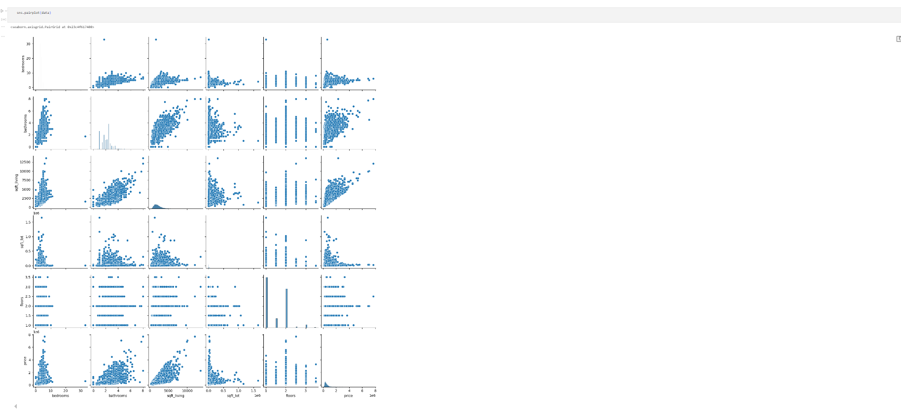
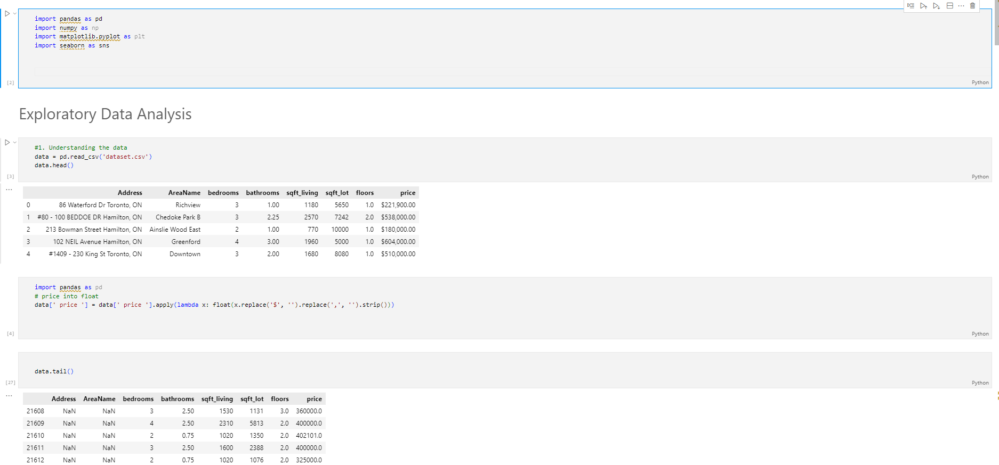

# House Price Prediction Using Linear Regression

This project focuses on predicting house prices using a Linear Regression model. By analyzing various features from a housing dataset, we aim to identify factors that influence house prices and build a predictive model.

## Table of Contents

1. [Introduction](#introduction)
2. [Dataset](#dataset)
3. [Libraries Used](#libraries-used)
4. [Data Exploration](#data-exploration)
5. [Data Cleaning](#data-cleaning)
6. [Data Visualization](#data-visualization)
7. [Model Building](#model-building)
8. [Evaluation](#evaluation)
9. [Results](#results)
10. [References](#references)

## Introduction

Predicting house prices is a common application of machine learning, where various features such as the number of bedrooms, bathrooms, and total living area are used to estimate the price of a house. This project uses Linear Regression, a simple yet powerful model, to predict house prices based on features extracted from a real estate dataset.

## Dataset

The dataset used for this project contains information about houses, including features like the number of bedrooms, bathrooms, total living area (sqft), and the lot size. Each record also includes the price of the house, which is our target variable.

- **Total number of samples**: Varies (depends on the dataset provided)
- **Features**: Includes `bedrooms`, `bathrooms`, `sqft_living`, `sqft_lot`, `floors`, and more.
- **Target variable**: `price` (the price of the house)

## Libraries Used

- `pandas`: For data manipulation and analysis.
- `numpy`: For numerical operations.
- `matplotlib`: For plotting graphs.
- `seaborn`: For data visualization.
- `scikit-learn`: For implementing the machine learning model.

## Data Exploration

Initial exploration of the dataset helps us understand the structure and content of the data:

1. **Data Loading**: Loaded the dataset using `pandas`.
2. **Basic Statistics**: Used methods like `head()`, `describe()`, and `nunique()` to get a quick overview of the dataset.
3. **Missing Values**: Checked for missing values using `isnull().sum()`.

```python
# Checking for missing values
data.isnull().sum()
```

## Data Cleaning

Data cleaning is crucial to ensure the model receives high-quality data:

1. **Removing Missing Values**: Dropped rows with missing values in critical columns such as `Address` and `AreaName`.
2. **Formatting Price**: Removed special characters and converted the `price` column to a numeric format.

```python
# Clean and convert price column
data[' price '] = data[' price '].apply(lambda x: float(x.replace('$', '').replace(',', '').strip()))
```

## Data Visualization

Data visualization provides insights into relationships between variables:

1. **Correlation Heatmap**: Showed the relationship between different numerical features.
2. **Pairplots**: Visualized pairwise relationships.
3. **Relational Plots**: Explored specific relationships, such as between living area and price, number of bedrooms and bathrooms, etc.

```python
# Correlation heatmap
sns.heatmap(data.corr(), annot=True)
```

### Observations:

1. **Price vs. Living Area**: Price tends to increase with the living area (`sqft_living`).
2. **Bedrooms vs. Living Area**: Houses with more bedrooms generally have larger living areas.
3. **Bathrooms vs. Bedrooms**: Houses with three or more bathrooms typically have at least three bedrooms.
4. **Bathrooms vs. Price**: More bathrooms often correlate with higher prices.

## Model Building

We used Linear Regression to model the relationship between the features and the target variable (price):

1. **Feature Selection**: Selected features like `bedrooms`, `bathrooms`, `sqft_living`, `sqft_lot`, and `floors`.
2. **Data Splitting**: Split the data into training and testing sets using `train_test_split()`.
3. **Model Training**: Trained a Linear Regression model using the training data.

```python
# Train-test split
X_train, X_test, y_train, y_test = train_test_split(X, y, test_size=0.2, random_state=42)

# Model training
model = LinearRegression()
model.fit(X_train, y_train)
```

## Evaluation

Evaluated the model using the R-squared score, which indicates how well the independent variables explain the variance in the dependent variable.

```python
# R-squared score
score = model.score(X_test, y_test)
print("R-squared score:", score)
```

## Results

The Linear Regression model showed reasonable performance with the following results:

- **R-squared Score**: Indicates how well the model explains the variability of the target variable. Higher scores imply better model performance.
- **Prediction Example**: Used the model to predict the price of a new house based on its features.

```python
# Example prediction
new_data = [[2, 1, 1050, 403365, 1]]
prediction = model.predict(new_data)
print("Prediction:", prediction)
```
## Screenshots





## References

- Scikit-Learn Documentation: [Linear Regression](https://scikit-learn.org/stable/modules/generated/sklearn.linear_model.LinearRegression.html)
- Kaggle: House Prices Dataset

---

This README provides a comprehensive overview of the house price prediction project using Linear Regression. For detailed implementation, visualizations, and insights, refer to the project notebook.
